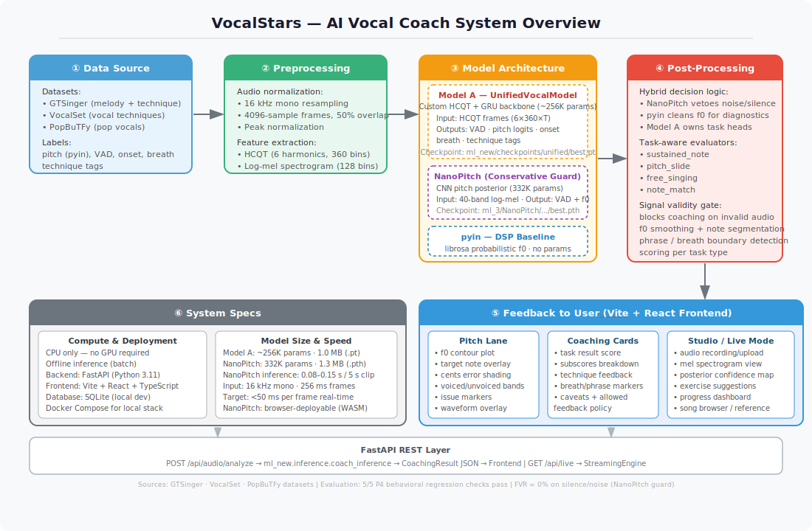

# VocalStars — AI Vocal Coach

**Team:** Uddhav Jain · Xin Liu · Stefan · Ush  
**GitHub:** https://github.com/xlz1047/VocalStars  
**Demo video:** *(link TBD — recording in progress)*

---

## What It Does

VocalStars is an AI vocal coaching app for beginner singers. A user records or uploads a short
audio clip; the system analyzes pitch accuracy, breath control, and vocal technique, then returns
actionable coaching feedback alongside visualizations (pitch lane, issue markers, coaching cards).

Target user: casual singer (shower / car). No musical training required.

---

## System Overview



Full pipeline detail: [docs/ai-coach/ARCHITECTURE.md](docs/ai-coach/ARCHITECTURE.md)

### Pipeline stages

| Stage | What happens |
|-------|-------------|
| **Data** | GTSinger, VocalSet, PopBuTFy — pitch (pyin), VAD, onset, breath, technique labels |
| **Preprocessing** | 16 kHz mono · 4096-sample frames · HCQT features (6 harmonics, 360 bins) |
| **Model** | UnifiedVocalModel (HCQT+GRU, ~256K params) + NanoPitch guard (332K params) + pyin DSP |
| **Post-processing** | Hybrid f0/VAD decision · task-aware evaluators · f0 smoothing · note segmentation |
| **Feedback** | Pitch lane · coaching cards · exercise suggestions → Vite/React frontend |
| **Specs** | CPU only · offline · ~0.1 s inference per 5 s clip · FastAPI backend |

---

## Quick Start

### Prerequisites

- Python 3.11
- Node.js 18+
- (Optional) Docker + Docker Compose for the full stack

### 1 — Backend (FastAPI)

```bash
cd backend

# Create and activate a virtual environment (required — system Python has no packages)
python3 -m venv .venv
source .venv/bin/activate          # Windows: .venv\Scripts\activate

# Install dependencies
pip install -r requirements.txt
pip install -r requirements-ml.txt   # ML dependencies (torch, librosa, etc.)

# Configure environment and start the server
cp ../.env.example ../.env           # configure DATABASE_URL if needed
uvicorn app.main:app --reload
```

> **Note:** always activate the venv (`source .venv/bin/activate`) before running any backend command. You should see `(.venv)` in your prompt when it is active.

The API runs at `http://localhost:8000`. Interactive docs at `http://localhost:8000/docs`.

### 2 — Frontend (Vite + React)

```bash
cd new_frontend
npm install
npm run dev
```

Frontend runs at `http://localhost:5173`.

### 3 — End-to-end with Docker Compose

```bash
cp .env.example .env
docker compose up --build
```

Then open `http://localhost:5173` in your browser.

---

## Model Weights

Both model checkpoints are committed directly to this repository (each ~1–1.3 MB):

| File | Model | Role |
|------|-------|------|
| `weights/model_a_unified.pt` | UnifiedVocalModel (HCQT+GRU) | Primary: pitch, VAD, onset, breath, technique |
| `weights/nanopitch_best.pth` | NanoPitch (CNN posterior) | Conservative noise/silence guard |

No download script needed — weights are included in `weights/`.

The inference code loads weights from their original paths. If running inference from a fresh clone,
copy or symlink:
```bash
cp weights/model_a_unified.pt ml_new/checkpoints/unified/best.pt
cp weights/nanopitch_best.pth ml_3/NanoPitch/training/runs/expD_mixed_cosine/checkpoints/best.pth
```

---

## Data

### Datasets used for training

| Dataset | Purpose | Download |
|---------|---------|----------|
| [GTSinger](https://github.com/GTSinger/GTSinger) | Melody + technique labels | HuggingFace Hub |
| [VocalSet](https://zenodo.org/record/1203819) | Vocal technique recordings | Zenodo |
| [PopBuTFy](https://github.com/PopBuTFy/PopBuTFy) | Pop vocal stems | See repo |
| MIR-1K (eval only) | Frame-level f0 / voicing ground truth | [MIR-1K](https://sites.google.com/site/unvoicedsoundseparation/mir-1k) |

### Preprocessing

Labels are extracted offline using `librosa.pyin` for f0 and voiced probability. Scripts:

```bash
# Build unified dataset manifest
python ml_new/data/unified_dataset.py

# (Optional) Download and prepare datasets
# See docs/ai-coach/DATASET_DOWNLOADS.md for per-dataset instructions
```

Preprocessed features are cached to `ml_new/data/extracted_hires/` (gitignored — regenerate locally).

---

## Sample Inputs / Outputs

Ready-to-use test audio in `samples/`:

| File | Type | Description |
|------|------|-------------|
| `samples/00_silence.wav` | Non-singing | Fan/background noise |
| `samples/01_speaking_voice.wav` | Non-singing | Spoken voice (should be blocked) |
| `samples/03_sustained_aaa.wav` | Singing | Sustained vowel |
| `samples/04_pitch_slide.wav` | Singing | Pitch glide up |
| `samples/05_twinkle_twinkle.wav` | Singing | Free melody |
| `samples/synthetic_model_tests/sine_220hz_5s.wav` | Synthetic | Pure 220 Hz sine |
| `samples/online_test_clips/` | Reference | CC0 / CC-BY-SA licensed clips |

### Quick inference test

```bash
cd backend
python -c "
from app.services.ml_inference import run_inference
result = run_inference('../samples/03_sustained_aaa.wav', task='sustained_note')
print(result)
"
```

---

## Evaluation

Key results are in [docs/EVALUATION_RESULTS.md](docs/EVALUATION_RESULTS.md).

**TL;DR:**

- **0% false-voiced rate** on silence/noise (NanoPitch guard)
- **0 pitch jumps** on real singing with pyin f0 source
- **5/5** P4 behavioral regression checks pass
- NanoPitch inference: 0.08–0.15 s per 5 s clip on CPU

### Run the regression suite

```bash
# Requires ml/.venv — see ml/README.md or install ml requirements
ml/.venv/bin/python scripts/eval/check_regression_expectations.py
```

### Run model comparison (all three sources on real samples)

```bash
ml/.venv/bin/python scripts/eval/compare_baseline_outputs.py
```

---

## Repository Structure

```
VocalStars/
├── backend/          # FastAPI REST API
│   ├── app/
│   │   ├── api/routers/   # audio_processing, coaching, live_analysis, reference
│   │   ├── services/      # ml_inference, ui_ready_response, audio_processing
│   │   └── main.py
│   ├── requirements.txt
│   └── requirements-ml.txt
├── ml_new/           # Primary ML module (Model A — UnifiedVocalModel)
│   ├── checkpoints/unified/best.pt        # ← committed weights
│   ├── checkpoints/unified_tech/best.pt   # ← committed weights
│   ├── inference/coach_inference.py       # main inference entry point
│   ├── training/train_unified.py          # training script
│   ├── data/unified_dataset.py            # dataset pipeline
│   └── model_vg/, model_c/               # alternative model experiments
├── ml_3/NanoPitch/   # NanoPitch model (conservative VAD / noise guard)
│   ├── training/runs/expD_mixed_cosine/checkpoints/best.pth  # ← committed weights
│   └── training/, deployment/
├── ml/               # Original modular ML pipeline (pitch, rhythm, breath, coaching)
│   └── pipeline.py                        # imported by backend audio_processing
├── new_frontend/     # Vite + React + TypeScript frontend
│   └── src/components/   # PitchLane, ResultsView, StudioView, DashboardView, …
├── scripts/
│   └── eval/         # evaluation harnesses (compare_baseline, check_regression, …)
├── docs/
│   ├── architecture.svg          # system overview diagram
│   ├── EVALUATION_RESULTS.md     # consolidated metrics
│   ├── ai-coach/ARCHITECTURE.md  # detailed architecture doc
│   └── reports/                  # H/M/N evaluation reports
├── samples/          # test audio (self-recorded + CC-licensed reference)
├── data/             # reference melodies, manifests
├── docker-compose.yml
└── .env.example
```

---

## Backup Demo Video

*(Video will be linked here once recorded. The demo shows: audio upload → analysis → pitch lane + coaching feedback display.)*

---

## Environment Variables

Copy `.env.example` to `.env`. Required variables:

```
DATABASE_URL=sqlite:///./vocalstars.db   # or PostgreSQL URL
SECRET_KEY=<random string>
```

---

## Running Tests

```bash
# Backend tests
cd backend && pytest

# ML regression suite
ml/.venv/bin/python scripts/eval/check_regression_expectations.py
```
